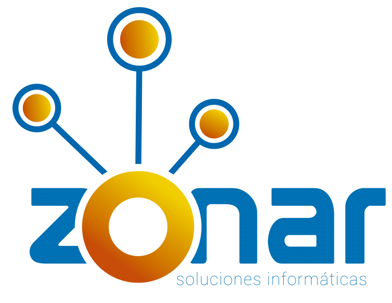

  

# ¿Quienes somos?

Somos como un Sonar, por nuestra forma de trabajo “iterativa”, donde visitamos a nuestros clientes y generamos espacios de planteamiento y discusión, con el objetivo claro de profundizar y encontrar soluciones. Estos planteamientos y cuestionamientos, son los que “rebotan” en nuestros cliente para luego nosotros  transformamos en software, en forma iterativa.

Zonar está conformada por personas, cada cual con sus propias emociones, motivaciones, creencias y formas de ver el mundo, cuyo bienestar y desarrollo personal son escenciales para el cumplimiento de sus objetivos personales y para comprometerse activamente con el logro de objetivos comunes dentro del contexto de una organización.

# VISIÓN

Posicionar a Zonar como un socio estratégico de cada uno de nuestros clientes. Contribuir a la optimización de los procesos de sus organizaciones aportando con ideas innovadoras que aprovechen eficientemente las Tecnologías de la Información.

# MISIÓN

Ganarnos la confianza de nuestros clientes, mediante la generación rápida de resultados y usando una metodología que promueva un trabajo integrado. Ser referentes tecnológicos con la capacidad de aprovechar nuestra Investigación y Desarrollo directamente en mejoras en la operación y gestión de sus organizaciones. Establecer relaciones a largo plazo, conseguir que nuestros clientes nos sigan eligiendo en el tiempo, porque somos quienes más valor aportamos en sus procesos.
